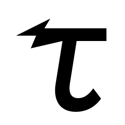

<p align="center">
  
</p>

<p align="center">
  <a href="https://www.npmjs.com/package/@depths/tach"></a>
  <a href="LICENSE"></a>
  <a href="docs/architecture.md"></a>
</p>

# Tach

Tach is a small, typed language for general-purpose GPU programming from
TypeScript applications. You write the parallel work the way you would write
a typed function. Tach owns the GPU ceremony that normally surrounds that
function: how the work is launched, how memory is laid out, how buffers
live across calls, how a finished image reaches a canvas, and how the same
program is checked for the browser and for native Vulkan.

```tach
export function scale[i](
  values: buffer<float32[]>,
  factor: float32,
) {
  if (i < values.length) {
    values[i] *= factor;
  }
}
```

One Tach project currently produces a typed JavaScript interface plus the two
GPU programs behind it: WGSL for browser WebGPU, and SPIR-V 1.6 for Vulkan
1.3. Application code uses the same buffers, recipes, and generated functions
on either host; it does not contain a WebGPU/Vulkan branch. A browser can
also `present` a Tach `view<srgb8>` straight to a canvas, so a finished
frame does not copy through JavaScript. A native MSL backend is planned for
an upcoming version, extending the same model to Apple GPUs without changing
Tach source into Metal-specific code.

Tach is deliberately a compute language rather than a graphics API, tensor
framework, or thin shader wrapper. It is intended for simulation, procedural
generation, numerical work, image processing, custom rendering compute,
physics, and other algorithms whose parallel work is worth expressing
directly.

## The GPU model in plain language

A CPU normally follows one instruction stream. It walks an array with a
`for` loop, one index after another. A GPU is useful when the same work can
happen at many indices at once: one array element, pixel, particle, or
simulation cell per run. Tach lets you write what one run does, then says
how many runs exist.

In the opening `scale` example, `[i]` is the current array index. Thousands
of runs may evaluate the same function with different `i` values.
`buffer<float32[]>` is storage that stays on the GPU across commands, while
`factor` is a small immutable value supplied for this call. The
`if (i < values.length)` guard is not timid style. GPUs launch work in
fixed-size groups, so the last group may extend past the array. Extra runs
must do nothing.

Three terms cover most Tach code:

- A **stage** is the work performed for one index (or pixel, or particle).
- A **dispatch** launches that stage across a 1D, 2D, or 3D domain.
- A **recipe** is the object a generated TypeScript function returns: one
  dispatch, or several in order, with compiler-managed scratch.

Calling `scale(...)` constructs a recipe; it does not run anything.
`gpu.submit(recipe)` queues it. Buffers stay on the GPU until the
application explicitly `read()`s or destroys them. That separation is the
core performance rule: send compact inputs and commands, keep large
intermediate data on the GPU, and read only what JavaScript genuinely needs.

Display follows the same model. You write linear floating-point pixels and
return `view<srgb8>`. Tach converts those pixels into 8-bit sRGB for a
screen. A browser then calls `present` to draw the GPU result directly,
without copying the frame through JavaScript.

## Why Tach exists

JavaScript and TypeScript developers have excellent ways to *use* the GPU, but
there is a large gap between high-level libraries and low-level GPU APIs.

At one end, a framework can provide tensors, operators, automatic
differentiation, or an entire rendering model. That is wonderfully productive
when the problem fits the framework. At the other end, WebGPU provides direct
and portable access to the GPU, but the application must own the shader
text, the resource plumbing, command encoding, readback, validation, and
usually a separate answer for native execution.

Tach occupies the space between those ends. The algorithm remains an explicit
kernel, but the ceremony becomes compiler-owned. The language is narrow enough
to validate consistently across its targets and familiar enough that a
TypeScript developer does not first need to become a graphics programmer.

That focus also explains how Tach relates to several nearby projects:

| Project | What it is designed around | How Tach differs |
|---|---|---|
| [CubeCL](https://github.com/tracel-ai/cubecl) | A Rust language extension, JIT compiler, and runtime family aimed at high-performance compute across a broad set of backends | CubeCL offers more backends and more scope for device-specific specialization. Tach offers a standalone, ahead-of-time language, a simpler baseline-kernel entry point, and npm/Deno ergonomics for TypeScript applications. Tach's optimizer and backend range are younger and deliberately narrower. |
| [wgpu](https://wgpu.rs/) | A Rust implementation of the WebGPU API for native and web applications | wgpu gives applications direct control over devices, resources, pipelines, and shader modules. Tach generates the shader and ABI and manages routine dispatch plumbing. That removes substantial ceremony, but it also exposes less low-level control and fewer backend-specific features. |
| [zgpu](https://github.com/zig-gamedev/zgpu) | A Zig helper layer over Dawn native WebGPU, shaped for Zig game and graphics development | zgpu makes direct WebGPU integration convenient for Zig programs and fits naturally into a graphics engine. Tach starts from typed compute kernels and exposes commands to TypeScript without application-owned WebGPU objects. Tach is less suitable when the program needs to control the surrounding graphics pipeline itself. |
| [PyTorch](https://pytorch.org/) | A tensor and machine-learning framework with a large operator ecosystem, automatic differentiation, and accelerator runtimes | PyTorch is vastly richer for standard tensor and ML work, and its mature operators are usually the right choice there. Tach has no tensor framework, model stack, autograd, or comparable library ecosystem. It instead allows the custom parallel operation itself-including irregular, simulation, and non-ML workloads-to be expressed directly. |

These are not interchangeable products and the distinctions are intentional.
Choose PyTorch when the problem is fundamentally tensor and ML work. Choose
wgpu or zgpu when the application should own the GPU API. Choose CubeCL when a
Rust-centered, aggressively specialized multi-backend compute stack fits the
project. Tach is for directly authored GPU compute that should feel native in
a TypeScript codebase and run through one API in browsers and on Vulkan.

Tach optimizes first for a low-friction language, compile-time validation, one
portable ABI, explicit multi-stage compute, and a small host API. It does not
claim that portable kernels automatically match hand-tuned CUDA, Metal, or
backend-specific libraries. It does not yet offer CUDA, ROCm, native MSL,
tensor-core intrinsics, a graphics pipeline, CPU fallback, or the ecosystems of
the older projects above. Those limits are the cost of keeping the current
model coherent and approachable while its optimizer and backend coverage grow.

## Install

Install the runtime and compiler from npm:

```sh
npm install @depths/tach
```

Tach tooling and native execution use Deno. Browser execution requires WebGPU;
native execution currently requires x86-64 Windows or Linux with a Vulkan 1.3
loader and compatible device. The compiler itself is available for x64 and
arm64 Windows and Linux, and Apple-silicon macOS.

The npm package provides both the `tach` command and the `@depths/tach`
runtime. The compiler binary for the current operating system and architecture
is resolved automatically.

## Create a project

A Tach project has one `tach.json` and one or more module directories. Each
module contains `.tach` files directly; deeper source nesting is intentionally
not part of the project model.

```text
scaling/
  tach.json
  kernels/
    scale.tach
```

Create `tach.json`:

```json
{
  "name": "scaling",
  "version": "0.1.0",
  "javascript": {
    "package": "@example/scaling"
  },
  "docs": {
    "title": "Scaling kernels",
    "summary": "Small GPU transforms used by the application."
  }
}
```

Save the opening kernel as `kernels/scale.tach`:

```tach
@docs(
  summary("Multiply every value in a buffer by one factor."),
  coordinate(i, "Index of the value to update."),
  param(values, "Values updated in place."),
  param(factor, "Multiplier applied to every value."),
)
export function scale[i](
  values: buffer<float32[]>,
  factor: float32,
) {
  // Rounded-up dispatches may contain an invocation beyond the buffer.
  if (i < values.length) {
    values[i] *= factor;
  }
}
```

Run project commands anywhere beneath `tach.json`:

```sh
npx tach fmt
npx tach check
npx tach build
```

`fmt` formats every kernel in the project. `check` validates the complete
project through both targets without writing output. `build` writes one
cohesive generated package:

```text
build/
  package.json
  index.js
  index.d.ts
  kernel.wgsl.gz
  kernel.spv
  README.md
  docs/
    kernels.md
```

Generated files are one unit and should not be edited by hand.

## Run a kernel

Import the Tach runtime and generated function separately:

```ts
import { tach } from "@depths/tach";
import { scale } from "./build/index.js";

const result = await tach(async (gpu) => {
  const values = gpu.buffer(new Float32Array([1, 2, 3, 4]));
  await gpu.submit(scale(values, 2));
  return values.read();
});

console.log(result); // Float32Array [2, 4, 6, 8]
```

The host model has three ordinary operations:

1. `gpu.buffer(value)` creates session-owned GPU state.
2. A generated function such as `scale(...)` constructs a reusable recipe.
3. `gpu.submit(...)` queues commands; `read()` or `idle()` waits for their
   completion.

The callback form of `tach()` owns the complete session lifetime. For
long-lived state, open and close the session explicitly:

```ts
import { tach } from "@depths/tach";
import { step } from "./build/index.js";

const gpu = await tach();
const state = gpu.buffer(initialState);

try {
  for (let frame = 0; frame < 1_000; frame++) {
    await gpu.submit(step(state, 1 / 60));
  }
  await gpu.idle();
} finally {
  gpu.close();
}
```

`submit()` waits for preparation and queue submission, not GPU completion.
Buffers belong to the session that created them; recipes themselves do not.
A recipe with buffers can run only in their owning session, while a
scalar-only recipe can run in any compatible session. Readback, `idle()`, and
the end of a scoped session are completion boundaries.

## The source model

Tach keeps simple kernels short without making larger algorithms opaque:

| Source form | Meaning | In TypeScript |
|---|---|---|
| `function helper(...)` | Ordinary value helper, called by GPU stages | Not exported |
| `function stage[i](...)` | Private GPU work for one index | Not exported |
| `export function kernel[i](...)` | The common case: one stage, one launch | Typed recipe constructor |
| `export function program(...)` | Several stages in order, optionally a display view | Typed recipe or view constructor |

The brackets declare logical invocation coordinates. A two-dimensional kernel
can use `[x, y]`; the host then supplies a matching logical size:

```tach
export function image[x, y](pixels: buffer<float32x4[]>) {
  const width = 1920;
  const pixel = y * width + x;
  if (pixel < pixels.length) {
    pixels[pixel] = float32x4(
      float32(x) / 1920.0,
      float32(y) / 1080.0,
      0.5,
      1.0,
    );
  }
}
```

```ts
await gpu.submit(image(pixels, { size: [1920, 1080] }));
```

Tach rounds logical sizes to complete workgroups, so kernels guard edge
invocations before indexing. Parameters are either `buffer<T>` GPU storage or
immutable values packed by the compiler. The core value types are `bool`,
`int32`, `uint32`, `float32`, and two-, three-, or four-lane numeric vectors.
Struct types are always emitted into the TypeScript API.

Files import other project files by extensionless module/kernel identity:

```tach
import "data/particles";
```

Declarations from the current file and from files it directly imports are
visible. Imports are not transitive: unlike `export *` in TypeScript,
importing a file does not also expose that file's imports. Names are unique
across the project, and the compiler rejects cyclic file or module
dependencies.

## Compose multi-stage work

An exported indexed function is the concise path for one launch. When one
operation needs several ordered steps, export a program instead:

```tach
function multiply[i](
  input: buffer<float32[]>,
  scratch: buffer<float32[]>,
  factor: float32,
) {
  scratch[i] = input[i] * factor;
}

function addBias[i](
  scratch: buffer<float32[]>,
  output: buffer<float32[]>,
  bias: float32,
) {
  output[i] = scratch[i] + bias;
}

export function transform(
  input: buffer<float32[]>,
  output: buffer<float32[]>,
  count: uint32,
  factor: float32,
  bias: float32,
) {
  const scratch = transient<float32>(count);
  run multiply(input, scratch, factor) over count;
  run addBias(scratch, output, bias) over count;
}
```

The host still receives one recipe constructor:

```ts
await gpu.submit(transform(input, output, count, 2, 0.5));
```

The compiler checks stage calls, domains, transient lifetimes, storage access,
and synchronization before either target is emitted.

## Produce and present a view

A view program turns linear floating-point RGBA into one backend-neutral
display result. It remains ordinary Tach orchestration, so a procedural frame
can be driven entirely by scalar parameters:

```tach
function paint[i](pixels: buffer<float32x4[]>, width: uint32, height: uint32) {
  if (i < pixels.length) {
    const x = i % width;
    const y = i / width;
    pixels[i] = float32x4(
      float32(x) / float32(width),
      float32(y) / float32(height),
      0.25,
      1,
    );
  }
}

export function gradient(width: uint32, height: uint32): view<srgb8> {
  const pixels = transient<float32x4>(width * height);
  run paint(pixels, width, height) over pixels.length;
  return view(pixels, width, height);
}
```

The generated function returns `ComputeView`, which is also a
`ComputeCommand`. `submit(view)` computes the picture and leaves it on the
GPU. In a browser, `present` draws it on a same-sized canvas:

```ts
import { tach } from "@depths/tach";
import { gradient } from "./build/index.js";

const canvas = document.querySelector("canvas")!;
const gpu = await tach();
try {
  await gpu.present(canvas, gradient(canvas.width, canvas.height));
} finally {
  gpu.close();
}
```

You write linear `float32x4` pixels. Tach converts them to 8-bit sRGB for
display. The browser stores that picture as a canvas texture; native Vulkan
stores the same bytes in a packed buffer. When the last pixel-writing stage
already writes each pixel once, Tach can do the conversion in that stage
and skip the extra full-frame float buffer. If the pixels belong to a
buffer you still need, it converts in a separate step. The TypeScript API
does not change.

## Documentation and agent guidance

Structured `@docs(...)` declarations are checked against the type or function
they describe and become documentation in generated Markdown and TypeScript
declarations. `//` is the single inline-comment form.

Every successful build refreshes the generated package documentation. Refresh
only documentation with:

```sh
npx tach docs
```

The npm package also contains a language and tooling guide designed for coding
agents. Its short index is available without a project or compiler invocation:

```sh
npx tach instructions
npx tach instructions --details 6 7
```

Other available commands are shown by `npx tach help`.

## Learn the complete language

- [Language guide](docs/language.md) - syntax, types, expressions, imports,
  programs, memory, synchronization, documentation, and diagnostics.
- [Examples guide](examples/README.md) - the canonical kernels, what each
  one does, and why it is in the corpus.
- [TypeScript guide](tach-ts/README.md) - runtime behavior, buffers, commands,
  execution, readback, errors, and generated bindings.
- [AI-agent guide](docs/INSTRUCTIONS.md) - the complete language and tooling
  reference intended for programmatic consumption.
- [Architecture guide](docs/architecture.md) - how projects move through the
  frontend, two IRs, target planning, code generation, packaging, and runtime.
- [IR guide](docs/ir.md) - Flow programs, Kernel templates, verification,
  optimization, and backend mapping.
- [ABI guide](docs/abi.md) - generated signatures, memory layout, metadata,
  view projection, sessions, and backend execution contracts.
